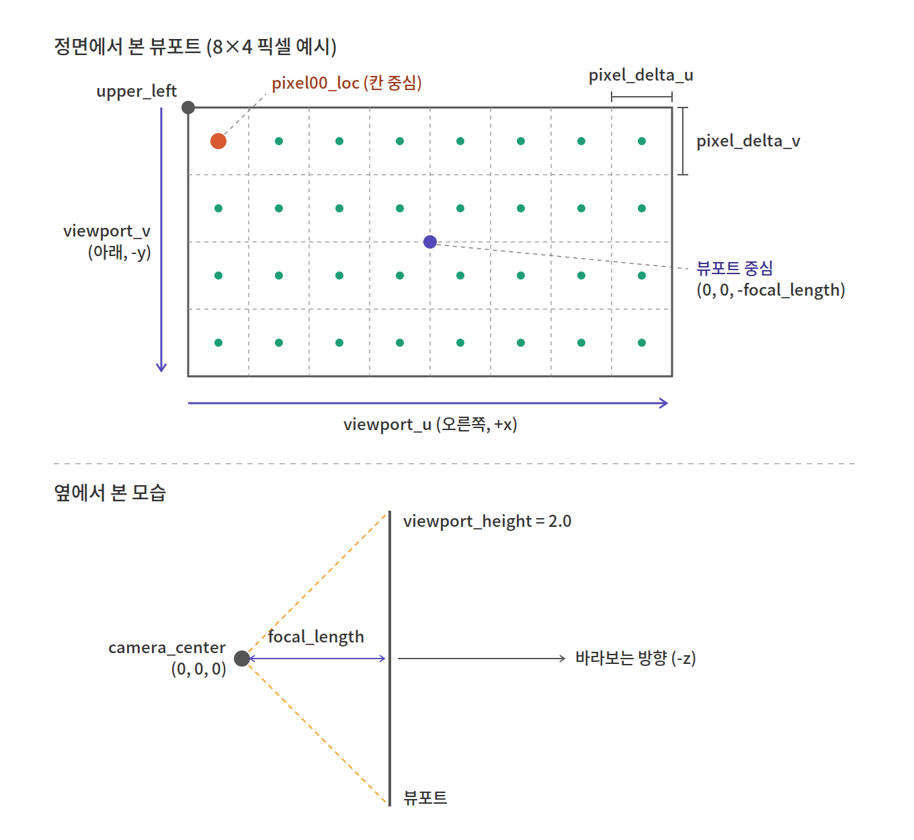

# Ch 4. Rays, a Simple Camera, and Background

> [초안](drafts/ch04-draft.md) · [사고 과정](thinking/ch04-thinking.md)

모든 레이트레이서가 가지고 있는 것
1. ray 클래스
2. ray를 따라 보이는 색을 계산하는 기능

## 4.1 The ray Class

ray를 함수 **P(t) = A + t·b** 로 생각한다.

- **P**: 3D 공간의 직선 위에 있는 한 점의 위치
- **A**: ray의 원점 (`orig`)
- **b**: ray의 방향 (`dir`)
- 카메라 ray라면 A = 카메라 위치, b = 카메라 중심 → 각 픽셀 위치로 향하는 방향이라고 생각하면 된다.

ray 파라미터 **t**는 실수이고, t에 다른 값을 넣으면 P(t)가 ray를 따라 이동한다.
- 음수 t까지 허용하면 직선 위 어디든 이동할 수 있다.
- 양수 t만 쓰면 A의 앞쪽 부분만 얻는다. 이걸 **half-line** 또는 **ray**라고 부른다 (t ≥ 0일 때만 ray).

코드에서는 `ray::at(t)`가 `orig + t*dir`을 반환한다.

### const 위치에 따른 의미
```cpp
const point3& origin() const { return orig; }
```
- 앞 `const`: 반환된 참조로 멤버를 수정할 수 없다.
- 뒤 `const`: 이 함수 안에서 멤버를 수정하지 않는다. 그래서 const 객체에서도 호출할 수 있다.

## 4.2 Sending Rays Into the Scene

레이트레이서의 핵심은 픽셀을 통과하는 ray를 쏘고, 그 ray 방향에서 보이는 색을 계산하는 것이다.
1. "눈"(카메라 중심)에서 픽셀을 지나는 ray를 계산한다.
2. 그 ray가 어떤 물체들과 교차하는지 판별한다.
3. 가장 가까운 교차점의 색을 계산한다.

### 이미지 크기 정하기

종횡비 16:9 = `width / height = 16 / 9`

```cpp
auto aspect_ratio = 16.0 / 9.0;
int image_width = 400;
int image_height = int(image_width / aspect_ratio);
image_height = (image_height < 1) ? 1 : image_height;
```
- width를 먼저 정하고, height는 `width / aspect_ratio`로 계산한다.
- `int` 변환 때문에 height가 0이 될 수 있어서 최소 1로 맞춘다.

### 뷰포트

뷰포트는 3D 세계 안에 있는 가상의 직사각형이다. 이미지 픽셀 위치들의 격자를 담고 있고, 카메라에서 나간 ray들이 이곳을 통과한다.
이미지와는 다르다. 뷰포트가 정하는 영역을 이미지로 만드는 것이다.

- **뷰포트**: 실수 좌표로 정의된 연속적인 사각형 영역. 그 위의 어느 점으로든 ray를 쏠 수 있다.
- **이미지**: 그 연속된 영역을 몇 개의 점으로 샘플링할지 정한 것.
- 그래서 `image_width`, `image_height`로 나눠서 뷰포트를 픽셀 수만큼의 칸으로 쪼갠다.



#### 그림 속 용어는 왜 이렇게 정의될까

> 이 부분을 이해한 과정은 [사고 과정](thinking/ch04-thinking.md#뷰포트-용어를-이해한-과정)에 있다.

출발점은 이 생각이다.
**뷰포트는 실수 좌표 위의 연속된 사각형이라 그 안에 점이 무한히 있다. 이미지 해상도는 그중 몇 개를 샘플링할지 정하는 것이다.**
그러면 필요한 건 "픽셀 (i, j)가 뷰포트 위의 어느 점인지" 알려주는 규칙이다. 그림 속 용어들은 전부 이 규칙을 만들려고 하나씩 등장한다.

**① 뷰포트를 어디에 둘까 → `camera_center`, `focal_length`, 뷰포트 중심**
- ray는 전부 한 점에서 출발한다. 그 점이 `camera_center`이고, 계산을 쉽게 하려고 원점 `(0, 0, 0)`에 둔다.
- 카메라가 -z를 보니까, 뷰포트는 그 방향으로 `focal_length`만큼 떨어진 곳에 **수직으로** 세운다. 그래서 뷰포트 중심은 `(0, 0, -focal_length)`이다.
- 수직으로 세우면 카메라가 뷰포트 한가운데를 정면으로 보게 된다. 그래서 화면이 상하좌우로 대칭이 된다 (핀홀 카메라의 광축과 같다).

**② 뷰포트 크기는 어떻게 정할까 → `viewport_height`, `viewport_width`**
- 뷰포트는 실제 크기(2.0 × 약 3.56)가 있지만, 그 숫자 자체에는 의미가 없다. 중요한 건 두 가지 **비율**뿐이다.
  - `viewport_height / focal_length`: 위아래로 얼마나 넓게 보는지, 즉 시야각을 정한다.
    예) 높이 4.0, 거리 2.0이어도 지금(2.0, 1.0)과 똑같은 그림이 나온다.
  - `viewport_width / viewport_height`: 가로세로 비율. 이미지 비율과 같아야 픽셀이 정사각형이 된다. 다르면 원이 타원으로 찍힌다.
- 그래서 높이만 직접 정하고, 너비는 실제 이미지 비율에서 계산한다.
- 옆에서 본 그림의 주황 점선 사이 각도가 시야각이다: `FOV = 2·atan((viewport_height / 2) / focal_length)`. 지금은 `2·atan(1) = 90°`이다.

**③ 뷰포트 위의 한 점을 어떻게 가리킬까 → `viewport_upper_left`, `viewport_u`, `viewport_v`**
- 사각형 위의 아무 점이나 "기준 모서리 + 가로로 몇 % + 세로로 몇 %"로 나타낼 수 있다.
  `점 = upper_left + s × viewport_u + t × viewport_v` (0 ≤ s, t ≤ 1)
- 그래서 `viewport_u`, `viewport_v`는 방향만 있는 벡터가 아니라 **변의 길이까지 담은** 벡터다. s = 1이면 정확히 반대쪽 끝에 도착한다.
- 기준을 왼쪽 위로 잡고 `viewport_v`를 아래(-y)로 둔 이유는 이미지 스캔 순서와 맞추기 위해서다. 이미지는 왼쪽 위에서 시작하고 아래로 갈수록 행 번호가 커진다. 이렇게 맞춰 두면 픽셀 번호를 뒤집을 필요 없이 그대로 쓸 수 있다.
- `viewport_upper_left`는 뷰포트 중심에서 반 칸이 아니라 **반 변**씩 되돌아간 점이다: `중심 - u/2 - v/2`

**④ 무한한 점 중 몇 개를 고를까 → `pixel_delta_u`, `pixel_delta_v`**
- 이미지 해상도가 여기서 처음 등장한다. 뷰포트 변을 픽셀 수로 나누면 한 칸의 크기가 나온다.
  `pixel_delta_u = viewport_u / image_width`
- 해상도를 400에서 800으로 올리면 칸만 촘촘해진다. 뷰포트(보이는 범위)는 그대로다.

**⑤ 칸 안의 어느 점을 쓸까 → `pixel00_loc`, 초록 점들**
- 픽셀은 점이 아니라 **칸 하나를 대표**한다. 그래서 칸의 중심을 쓴다.
  `pixel00_loc = upper_left + 0.5 × (pixel_delta_u + pixel_delta_v)`
- 모서리를 쓰면 첫 픽셀은 뷰포트 왼쪽 끝에 딱 붙고, 마지막 픽셀은 오른쪽 끝에서 한 칸 모자라게 된다. 그림이 한쪽으로 반 칸 치우친다. 중심을 쓰면 양 끝에서 똑같이 반 칸씩 떨어져서 대칭이 된다.
- 이제 모든 픽셀 위치는 이렇게 나온다 (초록 점들):
  `pixel_center = pixel00_loc + i × pixel_delta_u + j × pixel_delta_v`
- 마지막으로 ray 방향은 `pixel_center - camera_center`이다. 이게 이 모든 정의의 목적이다.

#### 뷰포트 크기는 이미지 해상도와 무관하다
- 뷰포트: 화면에 무엇이 들어오는지 결정한다 (시야 범위).
- 이미지: 그걸 몇 픽셀로 찍을지 결정한다 (해상도).
- 각 픽셀은 뷰포트 위의 한 점과 대응되지만, 뷰포트 크기를 이미지 해상도로 이해하면 안 된다.
- 뷰포트 높이는 `viewport_height = 2.0`으로 직접 정하고, 너비는 이미지의 **비율**만 따라간다. 해상도(400이냐 800이냐)는 영향을 주지 않는다.

예) 스마트폰 줌: 해상도는 그대로인데 담기는 풍경 범위가 달라진다.
→ 뷰포트 높이 ÷ `focal_length` 비율, 즉 **시야각**만 변한 것이다.

#### viewport_width를 계산할 때 aspect_ratio를 쓰지 않는 이유
```cpp
auto viewport_width = viewport_height * (double(image_width) / image_height);
```
`aspect_ratio`는 목표로 하는 이상적인 비율이다. 실제 `image_height`는 `int`로 잘리고 최소 1로 보정되기 때문에, 실제 이미지 비율과 다를 수 있다. 뷰포트는 **실제 이미지 비율**에 맞춰야 픽셀이 정사각형으로 유지된다.

### 카메라 중심

카메라 중심은 장면의 모든 ray가 출발하는 3D 공간상의 한 점이다 (흔히 **eye point**라고 한다).

- `focal_length`: 뷰포트와 카메라 중심 사이의 거리
- 카메라 중심에서 뷰포트 중심으로 향하는 벡터는 뷰포트와 **직교**한다.
  - 왜? 그렇게 설계한 것이다. 핀홀 카메라에서는 렌즈 중심에서 센서 중심으로 가는 축(광축)이 센서에 수직이고, 그래픽스의 카메라는 이걸 흉내 낸 것이다.
  - 대응 관계: **핀홀(렌즈 중심) = 카메라 중심**, **센서 = 뷰포트**.
  - 차이점: 실제 센서는 핀홀 **뒤**에 있어서 상이 뒤집혀 맺힌다. 뷰포트는 카메라 **앞**(-z 방향)에 둔 가상의 센서라서 상이 뒤집히지 않는다.

### 좌표계

간단하게 하기 위해 카메라 중심은 (0, 0, 0)에 둔다.
- y축은 위쪽, x축은 오른쪽이다.
- 바라보는 방향은 **-z**이다. 즉 +z는 화면에서 뒤쪽(보는 사람 쪽)을 가리킨다.
- 이 배치를 **오른손 좌표계**라고 한다.

이미지는 왼쪽 위 픽셀 (0, 0)부터 스캔한다. 각 행을 왼쪽에서 오른쪽으로 훑고, 행 단위로 위에서 아래로 내려간다.
즉 이미지 좌표의 Y축은 뒤집혀 있다. 이미지에서는 아래로 갈수록 Y가 증가한다.

→ 그래서 렌더 루프는 **바깥은 행(j, height) 루프, 안쪽은 열(i, width) 루프**여야 한다. 반대로 쓰면 PPM에 픽셀이 세로줄 순서로 들어가서 이미지가 깨진다.

### 뷰포트 벡터와 픽셀 위치

```cpp
auto viewport_u = vec3(viewport_width, 0, 0);    // 왼쪽 → 오른쪽 (+x)
auto viewport_v = vec3(0, -viewport_height, 0);  // 위 → 아래 (-y)

auto pixel_delta_u = viewport_u / image_width;   // 픽셀 간격 (가로)
auto pixel_delta_v = viewport_v / image_height;  // 픽셀 간격 (세로)

auto viewport_upper_left = camera_center - vec3(0, 0, focal_length)
                         - viewport_u / 2 - viewport_v / 2;
auto pixel00_loc = viewport_upper_left + 0.5 * (pixel_delta_u + pixel_delta_v);
```

- `viewport_v`가 -y 방향인 이유: 이미지 좌표는 아래로 갈수록 증가하기 때문이다.
- `viewport_upper_left`: 카메라 위치에서 -z로 `focal_length`만큼 간 곳이 뷰포트 중심이다. 거기서 `u/2`, `v/2`를 빼서 왼쪽 위 모서리를 구한다.
  - `viewport_v`는 아래 방향이라, 빼면 위로 올라간다.
- `pixel00_loc`: (0, 0) 픽셀 **칸의 중심**이다. 모서리에서 반 칸씩 안쪽으로 들어간 위치다.
- 이미지 해상도는 뷰포트를 몇 칸으로 나눌지(`pixel_delta`)만 결정한다.

### 선형 보간으로 배경 그리기

```cpp
color ray_color(const ray& r) {
    vec3 unit_direction = unit_vector(r.direction());
    auto a = 0.5 * (unit_direction.y() + 1.0);
    return (1.0 - a) * color(1.0, 1.0, 1.0) + a * color(0.5, 0.7, 1.0);
}
```

- **선형 보간(lerp)**: `blendedValue = (1 - a) * startValue + a * endValue` (0 ≤ a ≤ 1)
  - a = 0이면 startValue(흰색), a = 1이면 endValue(하늘색), 그 사이면 두 색이 섞인다.
- `a` 계산: 단위 벡터의 y는 -1 ~ 1 범위이다. 1.0을 더해 0 ~ 2로 만들고, 0.5를 곱해 0 ~ 1로 바꾼다.
- 결과: 위를 향하는 ray일수록 파란색, 아래를 향할수록 흰색이 된다.

### ray 방향과 정규화

> 이 부분을 이해한 과정은 [사고 과정](thinking/ch04-thinking.md#ray-방향과-정규화)에 있다.

#### ray 방향은 정규화하지 않는다
- `ray_direction = pixel_center - camera_center`를 그대로 저장한다.
- 교차점만 구할 때는 방향의 길이가 상관없다. `A + t·b`와 `A + (t/2)·(2b)`는 같은 점이고, `t` 값만 달라진다.
- 방향 성분이 필요한 곳에서 그때 정규화한다. 지금은 `ray_color`의 `unit_vector(r.direction())`, 나중에는 굴절(Dielectrics)의 `unit_vector(r_in.direction())`
  - `unit_vector(v)`는 `v / v.length()`로 길이 1인 **새 벡터**를 만든다. `r`의 `dir`은 그대로다.
- 주의: 방향이 단위 벡터가 아니면 `t`는 거리가 아니다. `t > 0.001` 같은 조건은 월드 거리 0.001이 아니라 "방향 벡터 길이의 0.001배"라는 뜻이다.

#### 정규화하면 y가 작아진다
- 정규화하면 길이가 1이 되고 방향은 그대로다. 세 성분이 같은 비율로 줄어서 y도 작아진다.
  - 예) `(0, 1, -1)` → 길이 √2 ≈ 1.41, y = 1
  - 정규화 후 `(0, 0.71, -0.71)` → 길이 1, y ≈ 0.71

#### y의 범위

| | 범위 | 이유 |
|---|---|---|
| 정규화 전 `r.direction().y()` | -1 ~ 1 | `viewport_height = 2.0`이라 뷰포트가 y = -1 ~ 1에 걸쳐 있음 (우연) |
| 정규화 후 이론상 범위 | -1 ~ 1 | 단위 벡터는 `x² + y² + z² = 1`이라 어떤 성분도 1을 넘을 수 없음 |
| 정규화 후 이 카메라에서 실제 범위 | 약 -0.71 ~ 0.71 | ray가 전부 뷰포트를 지나서, 정확히 위나 아래를 보는 ray는 없음 |

- 코드의 `0.5 * (y + 1.0)`은 이론상 범위(-1 ~ 1)를 가정한 것이다. 어떤 카메라에서든 `a`가 0 ~ 1에 들어오게 하려고.
- 이 카메라에서는 `a`가 대략 0.15 ~ 0.85만 쓰여서, 완전한 흰색이나 하늘색은 나오지 않는다.

#### 가로 그라데이션이 생기는 이유
- 정규화된 y = `y / √(x² + y² + 1)`
- 같은 행은 y가 같지만, 가장자리로 갈수록 x가 커져서 분모가 커진다. 그래서 정규화된 y가 0에 가까워진다.
- 맨 윗줄(y = 1) 예시:

| 위치 | x | 정규화된 y | a |
|---|---|---|---|
| 가운데 | 0 | ≈ 0.71 | ≈ 0.85 (더 파람) |
| 가장자리 | ±1.78 | ≈ 0.44 | ≈ 0.72 (더 흼) |

- 정규화하지 않고 `r.direction().y()`를 쓰면 한 행이 전부 같은 색이 된다. 순수하게 세로 그라데이션만 생긴다.
- 정규화 때문에 색 띠가 살짝 휘어진 곡선이 된다. 윗부분은 가운데가 더 파랗고, 아랫부분은 가장자리가 더 파랗다.

## PPM 포맷 메모

- P3 포맷은 픽셀 값을 **ASCII 텍스트**로 저장한다. 그래서 사람이 읽기 좋다.
- 대신 숫자를 글자로 쓰기 때문에 파일이 크다 (압축도 없음).
- **P6**는 같은 데이터를 **바이너리**로 저장한다. 채널당 1바이트라 파일이 훨씬 작아진다.
  - 압축은 아니고, 저장 방식만 바뀐 것이다.
  - 알파 채널 같은 새 정보가 추가되는 것도 아니다. PPM은 RGB만 담는다.
